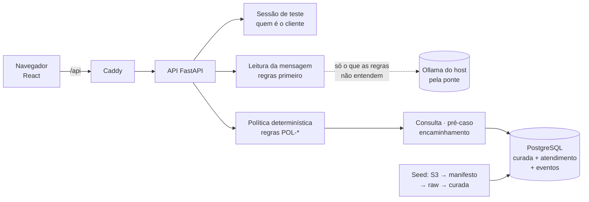

# jeje-product-v1

Atendimento bancário em espanhol e português do time **JEJE** (Jader, Erik, João e Enzo) —
Factored AI & Data Hackathon 2026.

O cliente conversa sobre as próprias transações: entende por que uma compra foi recusada ou está
pendente e registra um pedido de revisão (pré-caso) de cobrança que não reconhece. Fraude, pedido
de atendente e casos fora da regra vão para a fila humana com um resumo pronto. Quem decide é uma
política determinística com fatos do banco; o texto do cliente nunca muda permissão.

## Por que este fluxo

Medido na base do desafio (seção “Por que este fluxo” da interface, com a consulta de cada número;
`GET /dados/eda`):

- Contatos de motivo **transacional** são **35,0%** dos 686.296 atendimentos e **24,0%** do tempo
  total de atendimento, e **91,5%** se resolvem no primeiro contato: são perguntas com resposta nos
  dados.
- Das 4.425.008 transações, 5,0% foram recusadas, 2,0% estão pendentes e 1,0% foram estornadas;
  95% das recusas trazem código de resposta.
- Das reclamações sobre transações (20,2% de 67.095), **90,6%** são “Cargo no reconocido”.

O assistente automatiza exatamente isso: explica a situação de uma transação do próprio cliente e
registra o pedido de revisão (pré-caso) de uma cobrança não reconhecida, sempre com confirmação
explícita. Com os limites da política, 86,3% das transações aprovadas em USD da base poderiam ter a
contestação registrada sem atendente; o resto vai para um atendente com o resumo pronto. A base não
tem conversas em português (transcrições 100% em espanhol): os casos em português são do time.

## Como funciona



Toda consulta e ação leva o cliente da sessão (dado de outro cliente é igual a inexistente). O texto
do cliente só escolhe a pergunta feita à política; o modelo só classifica, nunca decide nem executa.
Efeito (pré-caso) só com um “sim” explícito ligado à proposta, gravado sem duplicar e relido antes
de responder.

## Ligar tudo

Precisa só de **Docker**.

```bash
cp .env.example .env   # cole as chaves do dataset (página 2 do dicionário)
make up                # ou: docker compose --profile modelo up -d --build --wait
```

Abra **http://localhost:8080**, entre como um cliente de demonstração e converse.

Na primeira vez o `make up` baixa o dataset dos organizadores (~1,6 GB, ~5 min), confere cada
arquivo pelo manifesto versionado em `data/manifesto/` e carrega o banco. Depois sobe em segundos.
Sem as chaves? `make up-fixture` sobe com um dataset sintético pequeno.

## Experimente

- **Contestar:** "No reconozco el cobro de 45,90 del 10/03/2025" (use valor e data de uma
  transação da sua lista) → o assistente mostra a transação e pede confirmação; "Sí, confirmo"
  registra o pré-caso e devolve o protocolo.
- **Perguntar:** "¿Por qué rechazaron mi compra?" → se houver mais de uma, ele lista e você escolhe.
- **Pedir um humano:** "Me robaron la tarjeta" → o caso aparece na fila do atendente, que o assume.

Em português também: "Não reconheço a cobrança…", "Por que recusaram minha compra?", "Roubaram
meu cartão". As métricas do atendimento (encaminhamentos, pré-casos, latência) ficam ao lado.

## Recarga dos dados

Quando a versão dos dados (`data/manifesto/`) ou o código do pipeline mudam, o `make up` recarrega
tudo numa transação só. Durante a recarga a API responde 503 na hora, com `Retry-After`, e a
readiness diz `reloading`. Nada espera nem mistura as duas versões. No fim da mesma transação, o
atendimento montado com os dados anteriores não atravessa a troca: as conversas em andamento ficam
encerradas (a tela oferece uma nova), as propostas de pré-caso pendentes vencem e as sessões caem
(volte ao acesso de teste). Conversas com atendente, encaminhamentos e pré-casos continuam como
registro. Mesma versão já carregada: nada muda.

## Modelo local

`make up` liga o modo modelo: as frases que as regras não entendem vão para um modelo local
(Ollama do host, `qwen2.5:7b`), que só classifica. Sim/não, fraude, pedido de atendente e
identificadores continuam com as regras, e a política decide o que fazer. A API lê a mensagem antes
de travar a conversa (esperar o modelo não prende o banco), pede a carga do modelo ao iniciar (log
`modelo pronto` ou `modelo indisponivel`) e o mantém carregado (`OLLAMA_KEEP_ALIVE`). Qualquer falha
— modelo fora do ar, lento, resposta fora do formato — segue pelas regras, e o trace do turno
(`app.eventos.interpretacao`, `make metricas`) diz quem leu cada mensagem e quanto o modelo custou.

- O Ollama do host continua escutando só em `127.0.0.1`. A ponte `ollama-ponte` (profile `modelo`)
  escuta só no IP do host na rede do Docker (172.17.0.1) e repassa: nada fica exposto na rede e o
  Ollama não é reconfigurado.
- Sem modelo: `INTERPRETADOR: "regras"` no serviço `api` do `compose.yaml`. Testes, fixture, CI e
  mutantes já rodam com regras (`compose.ci.yaml`).
- `make testar-modelo`: integração real com o Ollama (fora do gate; precisa da stack no ar).

### Classificador de intenção (próximo passo, ainda não integrado)

O classificador do time (branch `feat/intencao-classificador`, TF-IDF + regressão logística) entra
como mais um leitor atrás do mesmo contrato do modelo local, escolhido em `INTERPRETADOR`: as regras
leem primeiro, ele só lê o que elas não entendem, e sim/não, fraude, pedido de atendente e
identificador continuam com as regras. Os fluxos dele viram intenção e status (`explicar_recusa`,
`explicar_pendencia` e `explicar_estorno` → consultar com Declined, Pending e Reversed;
`abrir_disputa` → contestar; `relato_de_fraude` → fraude; `fora_de_escopo`). Só age com confiança de
0,8 ou mais: abaixo disso seguem as regras (esclarecimento), porque sem limiar 11,8% dos pedidos fora
de escopo de um conjunto real de pedidos a banco viravam disputa ou fraude.

## Logs

`make logs` mostra uma linha por acontecimento, marcada com o id da requisição:

```text
INFO jeje.conversa req=7489ce07… turno conversa=6nP-Nrp2jajGqdYt3AxszA numero=2 intencao=fraude regra=POL-HUM-01 acao=humano estado=com_humano efeito=AT-00000003
INFO jeje.http req=7489ce07… acesso metodo=POST rota=/conversas/{conversa_id}/turnos status=200 ms=13.7
WARNING jeje.db req=b0711da3… banco indisponivel erro=OperationalError motivo="failed to resolve host 'db'…"
```

- Toda resposta traz `X-Request-ID` (um id válido recebido é reaproveitado): quem relata um problema
  informa esse id, e ele leva às linhas do log.
- Nível em `LOG_LEVEL` no `compose.yaml`; `DEBUG` mostra também as sondas de saúde.
- Nunca entram a mensagem do cliente, o token, o identificador do cliente nem valores de SQL. Erro
  inesperado vira 500 com o id e um log com os arquivos e as linhas do código, sem a mensagem da
  exceção (o banco repete valores nela).

### Auditoria

Todo efeito deixa um evento em `app.eventos`, na mesma transação do efeito, com o mesmo id da
requisição (`requisicao`): turno da conversa (regra, ação, efeito, fontes, quem leu a mensagem e o uso
do modelo), erro de turno desfeito (só a classe), ação fora da conversa (proposta e pré-caso pelo
painel, atendente que assume) e a própria recarga dos dados (quantas conversas, propostas e sessões
ela encerrou). Do `X-Request-ID` de uma resposta chega-se às linhas do log, ao evento e, pelo efeito,
ao turno (`app.turnos`), ao pré-caso (`app.pre_casos`) ou ao encaminhamento (`app.handoffs`).
`make metricas` recomputa tudo dos eventos; os pré-casos contados batem com os gravados.

### Limites de tempo e respostas de falha

Tudo no `compose.yaml`. Nenhuma requisição fica pendurada: ou responde, ou falha rápido com uma
resposta que diz o que fazer.

| Situação | Limite | Resposta |
| --- | --- | --- |
| Banco fora do ar ou sem responder | conexão em 3 s (`DB_CONNECT_TIMEOUT_S`) | 503 com `Retry-After: 5` |
| Todas as conexões do pool ocupadas | espera de 5 s (`DB_POOL_*`: 5 + 10 excedentes) | 503 com `Retry-After: 5` |
| Comando SQL da API demorado | 5 s por comando (`DB_STATEMENT_TIMEOUT_MS`) | 503 com `Retry-After: 5` |
| Recarga dos dados em andamento | nenhuma espera | 503 com `Retry-After: 30` |
| Modelo lento, fora do ar ou resposta estranha | 10 s por chamada (`OLLAMA_TIMEOUT_S`) | segue pelas regras, motivo no trace |
| Erro inesperado | — | 500 com o id da requisição |

## Testar

```bash
make check          # segredos + lint + testes + mutantes (cada teste precisa pegar um defeito real)
make e2e            # jornadas no navegador (Chromium e Firefox) contra a stack no ar
make gate           # check + e2e + mutantes de ponta a ponta
make metricas       # métricas recomputadas dos eventos de cada turno
make testar-modelo  # integração real com o Ollama pela ponte (fora do gate)
scripts/repro.sh    # do zero: clone limpo, stack isolada com a fixture, todos os gates
```

## Onde fica cada coisa

- `compose.yaml` — **toda** a configuração não secreta (flags, limites, portas, testes).
  `.env` guarda só segredos e nunca vai para o Git.
- `backend/` — API (FastAPI) e migrations. Regras em `politica.py`, conversa em `conversa.py`,
  textos aprovados ES/PT em `mensagens.py`.
- `frontend/` — interface React; tipos gerados de `contrato/openapi.json` (`make contrato`).
- `e2e/` — jornadas no navegador; `mutantes/` — defeitos deliberados que os testes precisam pegar.
- `data/manifesto/` — versão dos dados (hash de cada arquivo); `data/fixture/` — dataset sintético.

## Operação e limites

- Política **simulada** e rotulada, com limites decididos pelo time (todos no `compose.yaml`): o
  assistente registra sozinho a contestação de transação aprovada até USD 5.000; à noite
  (20h–6h) pelo app ou pela web, até USD 1.000 por transação e 1.000 somados no dia (a base não
  diz se o aparelho é cadastrado, então todo acesso digital noturno conta como não cadastrado);
  transferência acima de USD 50.000 vai para análise de segurança. O resto vai para humano.
- Pré-caso é pedido de revisão: não move dinheiro nem promete prazo ou resultado.
- Motivo de recusa usa o significado genérico dos códigos ISO 8583, rotulado como tal.
- Acesso por cliente de demonstração (sem senha) e console do atendente existem só com
  `MODO_DEMO` ligado; num banco real, os dois exigiriam autenticação.
- Versão dos dados: o hash dos manifestos e o do código do pipeline ficam em `meta.dataset_version`
  (mostrados na página de status); mudou qualquer um, o `make up` recarrega (ver Recarga dos dados).
- Retenção: conversas, turnos, eventos, pré-casos e encaminhamentos ficam no banco sem expiração
  automática (demonstração); sessões valem 60 min e caem na recarga; propostas vencem em 10 min.
  Um banco real precisaria de prazo de retenção definido.
- Minimização: o modelo recebe só a mensagem, nunca cliente, transação ou sessão; os logs não
  guardam mensagem, token nem cliente; o encaminhamento leva o pedido cortado em 280 caracteres e só
  fatos verificados da transação.
- Capacidade medida neste PC (uma API, dados reais): turno lido pelas regras ~10 ms; com o modelo
  local carregado ~1,5 s; EDA inteira ~1 s; consulta por cliente abaixo de 1 ms; recarga completa
  ~5 min. Não medido: muitos clientes ao mesmo tempo e o servidor de publicação.
- Falta: publicação (destino por decidir), integração do classificador de intenção do time e a
  validação independente em andamento.
