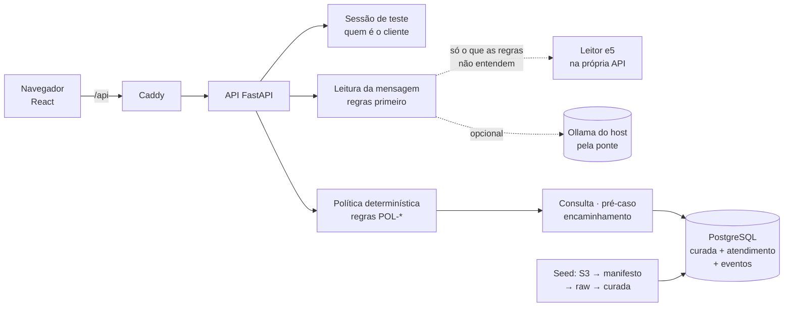

# factored-hackathon-2026-jeje

Atendimento bancário em espanhol e português do time **JEJE** (Jader, Erik, João e Enzo) —
Factored AI & Data Hackathon 2026.

O cliente conversa sobre as próprias transações: entende por que uma compra foi recusada ou está
pendente e registra um pedido de revisão (pré-caso) de cobrança que não reconhece. Fraude, pedido
de atendente e casos fora da regra vão para a fila humana com um resumo pronto. Quem decide é uma
política determinística com fatos do banco; o texto do cliente nunca muda permissão.

## Por que este fluxo

Medido na base do desafio (seção “Por que este fluxo” da interface, com a consulta de cada número;
`GET /dados/eda`):

- Contatos de motivo **transacional** são **35,0%** dos 686.296 atendimentos e **24,0%** do tempo
  total de atendimento, e **91,5%** se resolvem no primeiro contato: são perguntas com resposta nos
  dados.
- Das 4.425.008 transações, 5,0% foram recusadas, 2,0% estão pendentes e 1,0% foram estornadas;
  95% das recusas trazem código de resposta.
- Das reclamações sobre transações (20,2% de 67.095), **90,6%** são “Cargo no reconocido”.

O assistente automatiza exatamente isso: explica a situação de uma transação do próprio cliente e
registra o pedido de revisão (pré-caso) de uma cobrança não reconhecida, sempre com confirmação
explícita. Com os limites de valor, horário e canal, 86,3% das transações aprovadas com valor em
dólar da base (3.979.375: as em USD e as em COP ou ARS com `amount_usd`) poderiam ter a contestação
registrada sem atendente. A janela de 120 dias, contada do último dia dos dados (18/06/2026), deixa
contestável pelo assistente 11,2% dessas compras (a base cobre três anos); dentro da janela, 86,3%
seguem sem atendente, 9,6% da base. Os três números são os que a validação reproduziu (DADOS-08);
a medição anterior do time dava 85,7% dentro da janela, que não se reproduziu. O resto vai para um
atendente com o resumo pronto. A base não tem conversas em português (transcrições 100% em
espanhol): os casos em português são do time.

## Como funciona



Toda consulta e ação leva o cliente da sessão (dado de outro cliente é igual a inexistente). O texto
do cliente só escolhe a pergunta feita à política; o modelo só classifica, nunca decide nem executa.
Efeito (pré-caso) só com um “sim” explícito ligado à proposta, gravado sem duplicar e relido antes
de responder.

## Ligar tudo

Precisa só de **Docker**.

```bash
cp .env.example .env   # cole as chaves do dataset (página 2 do dicionário)
make up                # ou: docker compose --profile modelo up -d --build --wait
```

Abra **http://localhost:8080**, entre como um cliente de demonstração e converse. A página tem três
abas, cada uma com endereço próprio: **Cliente** (`#cliente`: acesso, conversa, transações e
pré-casos), **Atendente** (`#atendente`: fila e bloqueios de cartão) e **Operação** (`#operacao`:
métricas, status, qualidade dos dados e EDA).

Na primeira vez o `make up` baixa o dataset dos organizadores (~1,6 GB, ~5 min), confere cada
arquivo pelo manifesto versionado em `data/manifesto/` e carrega o banco. O build da imagem também
baixa o leitor (torch só-CPU e pesos do e5, ~2 GB) e o treina (~11 min em CPU); a imagem da API
fica com ~3,9 GB. Depois sobe em segundos.
Sem as chaves? `make up-fixture` sobe com um dataset sintético pequeno.

## Experimente

- **Contestar:** "No reconozco el cobro de 45,90 del 10/03/2025" (use valor e data de uma
  transação da sua lista) → o assistente mostra a transação e pede confirmação; "Sí, confirmo"
  registra o pré-caso e devolve o protocolo.
- **Perguntar:** "¿Por qué rechazaron mi compra?" → se houver mais de uma, ele lista e você escolhe.
- **Cobrança repetida:** "Me cobraron dos veces el streaming" → é contestação, não consulta.
- **Acompanhar o pedido:** "¿Cómo va mi solicitud?" (ou o protocolo) → o estado dos pré-casos do
  cliente, sem prazo nem resultado.
- **Pedir um humano:** "Me robaron la tarjeta" → o caso aparece na fila, na aba Atendente, e o
  atendente o assume.
- **Bloquear o cartão (simulado):** "Quiero bloquear mi tarjeta" → com um cartão ativo, bloqueia na
  hora. No acesso, escolha o dispositivo: *cadastrado* dá bloqueio completo, que só aparece no
  console; *novo* (o padrão) dá bloqueio preventivo e encaminha ao atendente. Com vários cartões,
  ele pergunta qual (número da opção ou os 4 últimos dígitos). O relato de roubo encaminha na hora
  e também bloqueia: com vários cartões, o caso já está na fila quando ele pergunta qual bloquear.
  Dentro do prazo de 7 dias, "Quiero desbloquear mi tarjeta" desfaz com um sim o bloqueio feito
  por aqui, inclusive o do relato de roubo (urgência); depois, só o atendente, no console
  ("Desbloquear BL-…"). O caso do atendente ligado ao bloqueio é anotado em todo desbloqueio.

A conversa vai por etapas (pedido → transação → confirmação). O que não cabe na etapa recebe o que
foi entendido e a oferta de um atendente ("Falar com um atendente" encaminha, "Continuar aqui" volta
para onde estava), no lugar de um "não entendi" repetido. As pistas da transação somam entre os turnos (o status citado é pista,
não filtro), "a última" escolhe a mais recente, e cumprimento ou agradecimento recebe resposta
cordial sem perder a etapa. Data sem ano é lida a partir do último dia dos dados quando a base é
mais antiga que o relógio. Contestar é só pela conversa. O valor é lido com milhar em ponto, espaço
ou vírgula seguida de 3 dígitos e decimal em vírgula ou ponto ("189.900,55", "6,050.00", "45.90",
"13,45"), com ou sem o código da moeda, inclusive colado ("USD13,45"); a transação casa com o valor
dito com tolerância de 1 centavo.

Quando o filtro exato não acha nenhuma transação (o valor dito de cabeça, a data errada por um
dia), as do próprio cliente que podem ser a descrita (do comércio citado; sem comércio, com o valor
a até 10% ou a data a até 7 dias) são ordenadas pelas pistas (DEV-037). Um conjunto conformal diz
quando uma delas é a certa com garantia (α = 5%): aí a conversa segue com ela, sempre com a
confirmação antes do pré-caso. Sem essa garantia, mostra as possíveis: até três viram botões, e
com mais a conversa pergunta pelo campo que mais as divide, fora o que o cliente já disse ("¿En qué
comercio fue?"). Os pesos e o limiar vêm de `make calibrar-transacao` (`python -m
jeje.calibrar_qual_transacao`), que sorteia 6.000 clientes da base, descreve uma transação de cada
um em ES e PT e lê a frase com os extratores da conversa; o arquivo versionado
(`backend/src/jeje/qual_transacao.json`) só tem agregados. No teste da calibração (dados reais),
a conversa resolve direto 96% dos pedidos com pista, contra 58% do filtro exato sozinho, sem
nenhuma proposta errada, e pede dados de novo em 0,04%, contra 40%; nos históricos densos (10
clientes juntos), 83% contra 53%. `RESOLVEDOR_DE_TRANSACAO: "filtro"` no `compose.yaml` volta ao
filtro exato.

Atalhos sob a conversa mandam frases prontas (consultar, contestar, status do pedido, bloquear
cartão e pedir um atendente), e "Perguntar sobre esta", em cada linha das transações, manda à
conversa as pistas da linha (nunca o identificador). Sob cada resposta, "Por que esta resposta?"
mostra a regra e o que ela quer dizer, a ação, o efeito, as fontes e quem leu a mensagem.

Em português também: "Não reconheço a cobrança…", "Por que recusaram minha compra?", "Status do
meu pedido de revisão", "Roubaram meu cartão". As métricas do atendimento (encaminhamentos,
pré-casos, latência) ficam na aba Operação.

## Testar em grupo (túnel e reviews)

O time conversa com o assistente numa demonstração publicada por um túnel e avalia cada conversa;
as avaliações ficam no banco da demonstração para o erro ser discutido e corrigido.

1. **Subir:** numa máquina com Docker e o `cloudflared` (`brew install cloudflared`), `make demo`.
   Sobe uma stack separada (projeto `jeje-demo`, banco próprio) com a fixture sintética e o leitor
   e5 em `127.0.0.1:8082` (`make demo DEMO_PORTA=…` muda a porta) e abre um quick tunnel do
   cloudflared: grátis, sem conta. O endereço `https://….trycloudflare.com` aparece no log do túnel
   e muda a cada vez que ele sobe.
2. **Entrar:** mande o endereço para o time. Sem `SENHA_DA_DEMO` no `.env`, qualquer pessoa com o
   link entra (o acesso é o de demonstração); com ela, o túnel pede a senha, como na publicação
   para os jurados. O túnel dura enquanto o `make demo` estiver rodando, e a demo sobe junto da
   stack do `make up` (banco e API sem porta no host).
3. **Conversar e avaliar:** escolha um cliente, converse, e no fim preencha *Avaliar esta conversa*:
   quem está testando, nota de 1 a 5, se o assistente resolveu e o que deu errado ou como deveria
   ter sido. A review fica em `app.reviews`, ligada à conversa.
4. **Virar Issue (opcional):** a demonstração não passa token do GitHub, então nada é publicado
   sozinho. Para publicar as pendentes como Issues com a etiqueta `review-teste` e a transcrição:
   `COMPOSE_PROJECT_NAME=jeje-demo GITHUB_TOKEN=… make exportar-reviews`.

Quem pode avaliar é `TESTADORES` no `compose.yaml`. `make demo-down` para a demonstração; os dados e
as reviews continuam no volume do banco para a próxima vez.

Para começar de novo sem recarregar a base, `make demo-limpar` (ou `make limpar`, na stack do
`make up`) apaga conversas, pré-casos, encaminhamentos, bloqueios, sessões e eventos (as métricas
zeram). Ficam a base, as personas e as reviews, com as conversas avaliadas; os protocolos não se
repetem. Enquanto limpa, a API responde 503. Útil porque, com 3 pré-casos em 30 dias, a contestação
de uma persona vai para o atendente (reincidência, POL-HUM-06).

## Publicação para os jurados

A demonstração com os dados do desafio fica num endereço fixo, atrás de uma senha que só os jurados
recebem (PRD-009). O portão fica na API: sem o cookie de acesso, toda rota responde 401, inclusive
a documentação e o contrato; só a saúde e o próprio acesso abrem. Quem entra com a senha cai no guia
**How to test**, com os três caminhos em espanhol e português. O cookie é HttpOnly, `Secure` e vale
7 dias; trocar a senha fecha todos.

1. **Uma vez:** o túnel nomeado do Cloudflare (`cloudflared tunnel create jeje` e
   `cloudflared tunnel route dns jeje <endereço>`). No `.env`, `CLOUDFLARE_TUNNEL_TOKEN`
   (`cloudflared tunnel token jeje`) e `SENHA_DOS_JURADOS` (16 ou mais caracteres).
2. **Publicar:** `make publicar`, no `main` limpo e igual ao `origin/main`. Roda o gate (segredos,
   lint e testes), as jornadas no navegador numa stack isolada com o portão ligado
   (`make e2e-pelo-portao`), sobe a stack `jeje-pub` (dados reais, sem portas no host, imagens com a
   tag do commit, tudo volta sozinho depois de um reinício) e confere o endereço público
   (`scripts/conferir-publicacao.sh`): sem acesso, 401; senha errada, 401; a certa, cookie seguro.
3. **Tirar do ar:** `make publicacao-down` (o banco fica).

## Recarga dos dados

Quando a versão dos dados (`data/manifesto/`) ou o código do pipeline mudam, o `make up` recarrega
tudo numa transação só. Durante a recarga a API responde 503 na hora, com `Retry-After`, e a
readiness diz `reloading`. Nada espera nem mistura as duas versões. No fim da mesma transação, o
atendimento montado com os dados anteriores não atravessa a troca: as conversas em andamento ficam
encerradas (a tela oferece uma nova), as propostas de pré-caso pendentes vencem e as sessões caem
(volte ao acesso de teste). Conversas com atendente, encaminhamentos e pré-casos continuam como
registro. Mesma versão já carregada: nada muda.

## Leitor de intenção (e5)

A API da demonstração lê em cascata: as regras leem primeiro, e só as frases que elas não entendem
vão para o leitor e5, um classificador que roda na CPU da própria API (~15–90 ms por mensagem,
nenhuma chamada de rede). Ele só classifica: vira intenção e status pelo mapeamento abaixo, e só com
confiança calibrada de 0,8 ou mais (`LEITOR_LIMITE`); abaixo disso a frase segue como não entendida
e a conversa responde com o que entendeu e a oferta de um atendente. Sim/não, fraude por palavra, pedido de atendente, valor, data, comércio
e identificadores continuam com as regras, e a política decide o que fazer. A API pede a carga do
leitor ao iniciar (log `leitor pronto` ou `leitor indisponivel`); qualquer falha segue pelas regras,
e o trace do turno (`app.eventos.interpretacao`, `make metricas`) diz quem leu cada mensagem:
`regras`, `leitor:e5@<versão>` ou `regras (leitor abaixo do limite)`.

- Modelo: `intfloat/multilingual-e5-base` (MIT) para transformar a frase em vetor + regressão
  logística nos fluxos, com a confiança calibrada por temperatura. Fluxo → leitura:
  `explicar_recusa`, `explicar_pendencia`, `explicar_estorno` → consultar com Declined, Pending,
  Reversed; `ver_transacoes` → consultar; `abrir_disputa` → contestar; `relato_de_fraude` → fraude;
  `fora_de_escopo`.
- Dados (todos CC-BY-4.0, fixados por commit e sha256 em `backend/src/jeje/leitor/corpus.py`):
  BANKING77 (PolyAI) em inglês e as traduções revisadas `c2d-usp/banking77-es-la` e
  `c2d-usp/banking77-pt-br`; MInDS-14 (PolyAI, fala real transcrita, es-ES e pt-PT) só no treino,
  para as categorias que o BANKING77 não tem (problema com o cartão, bloqueio, ver transações). A
  base do desafio não serve de gabarito: 42 textos distintos em 171 mil transcrições.
- Treino no estágio `modelo` da imagem (`python -m jeje.leitor treinar`); a versão é o hash das
  entradas (dados, pesos, mapeamento, parâmetros). Teste do BANKING77 (9.240 frases, nunca vistas
  no treino): acurácia 0,889 (en), 0,889 (es), 0,873 (pt); com confiança ≥ 0,8, 78% das frases, 96%
  de acerto. Mac e Docker dão a mesma versão, com alguns décimos de diferença na acurácia (ponto
  flutuante do torch).
- `make avaliar-leitor` (fora do gate, ~1,5 min, sem banco), no teste do BANKING77 em es e pt
  (6.160 frases), por mensagem: só as regras entendem certo 14% e pedem de novo 67–68%; com o
  leitor a 0,8, certo 63–66%, pedem de novo 13–18%, errado 18–19% (16–18% só com as regras) e
  fora de escopo lido como contestação ou fraude 0,6–0,9%. Mostra também os limites 0,7 e 0,9.
- Medido no protótipo do time (conversas simuladas com a `conversa.py` real e 80 clientes da base):
  sucesso 0,81 só com regras e 0,965 com o leitor em cascata. Fala real (MInDS-14, testado na língua
  que ficou fora do treino): pedidos fora de escopo que viram disputa ou fraude 0–0,8% (4,4% no
  pt-PT), contra 5–6% de um TF-IDF só com BANKING77.
- Limites: quando as regras acham que entenderam, o leitor nem é chamado, e 11–24% das frases dos
  conjuntos de teste terminam no fluxo errado por isso (medido antes das regras de cobrança
  repetida, que tiram "me cobraron dos veces" da consulta). O BANKING77 é traduzido e o MInDS-14 é ibérico: gíria latino-americana ("me la
  rebotaron", "pix") fica abaixo do limite e cai no esclarecimento. A avaliação que vale é um
  conjunto ES/PT escrito pelo time.
- Sem leitor: `INTERPRETADOR: "regras"` no serviço `api` do `compose.yaml`. Testes, fixture, CI e
  mutantes já rodam com regras (`compose.ci.yaml`); os testes do leitor usam um codificador falso
  (a imagem de testes não tem torch).

### Portão de intenção TF-IDF (Enzo)

O primeiro classificador de Enzo (tag `arquivo/intencao-classificador`) está no produto ao lado
do leitor e5. É um TF-IDF de n-gramas de caracteres (2 a 5, dentro das palavras), seguido de
regressão logística. Ele treina no mesmo corpus e nos mesmos fluxos do leitor, no estágio
`intencao` da imagem (~1 min, sem o e5), e o artefato tem 2 MB.

Ele não decide nada na conversa. Responde em duas rotas, e sem o artefato as duas dão 503 e o
resto da API segue:

- `POST /intencao/classificar`: o fluxo, a probabilidade de cada fluxo e os n-gramas que mais
  pesaram, em ~3 ms por mensagem;
- `GET /intencao/modelo`: a versão, as fontes e as métricas por idioma.

No teste do BANKING77 (3.080 frases por idioma), a acurácia é 0,900 em en, 0,892 em es e 0,896
em pt.

No `make avaliar-leitor`, ele entra na mesma comparação, por mensagem, em es e pt:

| Leitura | Certo (es / pt) | Fora de escopo lido como ação (es / pt) |
|---|---|---|
| Só as regras | 14,6% / 15,0% | 0,3% / 0,4% |
| Regras e leitor e5 a 0,8 (a API) | 66,0% / 63,1% | 0,6% / 0,9% |
| Regras e TF-IDF a 0,8 | 55,4% / 56,2% | 0,5% / 0,6% |
| Leitor e5 sozinho | 89,3% / 87,8% | 3,1% / 3,4% |
| TF-IDF sozinho | 89,6% / 90,0% | 3,0% / 2,8% |

Sozinhos, os dois acertam o mesmo, com o TF-IDF à frente em pt. No limite da API, o e5 decide
mais frases (53% contra 41% em es), porque as probabilidades do TF-IDF são menos concentradas: ele
não tem a calibração por temperatura do leitor. Por isso a cascata da API continua com o e5. Pela
regra do time, nada de Enzo é trocado sem resultado melhor.

### Modelo local (Ollama, opcional)

`INTERPRETADOR: "ollama"` troca o leitor por um modelo local (Ollama do host, `qwen2.5:7b`) no
mesmo papel: só classifica o que as regras não entendem, e diz a língua, a intenção e o status
citado. Quando é chamado, pode ler fraude ou pedido de atendente (o turno encaminha), mas nunca
confirma nem escolhe transação, e a política decide o que fazer. Cumprimento e agradecimento não
viram pedido de atendente, e perguntar pelo estorno é consulta, não contestação (ACH-102). A API
pede a carga do modelo ao iniciar (log `modelo pronto` ou `modelo indisponivel`) e o mantém
carregado (`OLLAMA_KEEP_ALIVE`); qualquer falha — modelo fora do ar, lento, resposta fora do
formato — segue pelas regras, e o trace do turno diz quanto o modelo custou (~0,7 s por turno).

- O Ollama do host continua escutando só em `127.0.0.1`. A ponte `ollama-ponte` (profile `modelo`)
  escuta só no IP do host na rede do Docker (172.17.0.1) e repassa: nada fica exposto na rede e o
  Ollama não é reconfigurado.
- `make testar-modelo`: integração real com o Ollama (fora do gate; precisa da stack no ar).

## Logs

`make logs` mostra uma linha por acontecimento, marcada com o id da requisição:

```text
INFO jeje.conversa req=7489ce07… turno conversa=6nP-Nrp2jajGqdYt3AxszA numero=2 intencao=fraude regra=POL-HUM-01 acao=humano estado=com_humano efeito=AT-00000003
INFO jeje.http req=7489ce07… acesso metodo=POST rota=/conversas/{conversa_id}/turnos status=200 ms=13.7
WARNING jeje.db req=b0711da3… banco indisponivel erro=OperationalError motivo="failed to resolve host 'db'…"
```

- Toda resposta traz `X-Request-ID` (um id válido recebido é reaproveitado): quem relata um problema
  informa esse id, e ele leva às linhas do log.
- Nível em `LOG_LEVEL` no `compose.yaml`; `DEBUG` mostra também as sondas de saúde.
- Nunca entram a mensagem do cliente, o token, o identificador do cliente nem valores de SQL. Erro
  inesperado vira 500 com o id e um log com os arquivos e as linhas do código, sem a mensagem da
  exceção (o banco repete valores nela).

### Auditoria

Todo efeito deixa um evento em `app.eventos`, na mesma transação do efeito, com o mesmo id da
requisição (`requisicao`): turno da conversa (regra, ação, efeito, fontes, quem leu a mensagem e o uso
do modelo), erro de turno desfeito (só a classe), ação fora da conversa (proposta e pré-caso pelo
painel, atendente que assume) e a própria recarga dos dados (quantas conversas, propostas e sessões
ela encerrou). Do `X-Request-ID` de uma resposta chega-se às linhas do log, ao evento e, pelo efeito,
ao turno (`app.turnos`), ao pré-caso (`app.pre_casos`) ou ao encaminhamento (`app.handoffs`).
`make metricas` recomputa tudo dos eventos; os pré-casos contados batem com os gravados.

### Limites de tempo e respostas de falha

Tudo no `compose.yaml`. Nenhuma requisição fica pendurada: ou responde, ou falha rápido com uma
resposta que diz o que fazer.

| Situação | Limite | Resposta |
| --- | --- | --- |
| Banco fora do ar ou sem responder | conexão em 3 s (`DB_CONNECT_TIMEOUT_S`) | 503 com `Retry-After: 5` |
| Todas as conexões do pool ocupadas | espera de 5 s (`DB_POOL_*`: 5 + 10 excedentes) | 503 com `Retry-After: 5` |
| Comando SQL da API demorado | 5 s por comando (`DB_STATEMENT_TIMEOUT_MS`) | 503 com `Retry-After: 5` |
| Recarga dos dados em andamento | nenhuma espera | 503 com `Retry-After: 30` |
| Modelo lento, fora do ar ou resposta estranha | 10 s por chamada (`OLLAMA_TIMEOUT_S`) | segue pelas regras, motivo no trace |
| Erro inesperado | — | 500 com o id da requisição |

## Testar

```bash
make check          # segredos + lint + testes + mutantes (cada teste precisa pegar um defeito real)
make e2e            # jornadas no navegador (Chromium e Firefox) contra a stack no ar
make gate           # check + e2e + mutantes de ponta a ponta
make metricas       # métricas recomputadas dos eventos de cada turno
make avaliar-leitor # leitura por mensagem no BANKING77 es/pt: regras, e5 e TF-IDF (sem banco)
make testar-modelo  # integração real com o Ollama pela ponte (fora do gate)
make repro          # do zero: clone limpo, stack isolada com a fixture, segredos e todos os gates
```

O CI roda aqui, no build, sem GitHub (decisão do time): a imagem do web só sai com typecheck,
lint e testes do web verdes (`npm run ci` no estágio de build), e `make check`, `make gate` e
`make repro` rodam o resto na própria máquina. As stacks de mutantes E2E constroem o web sem os
testes, porque ali o defeito plantado precisa subir para a jornada no navegador o pegar.

## Onde fica cada coisa

- `compose.yaml` — **toda** a configuração não secreta (flags, limites, portas, testes);
  `compose.ci.yaml` (fixture, só regras), `compose.demo.yaml` (demonstração pelo túnel),
  `compose.publicacao.yaml` (jurados: senha, túnel nomeado) e `compose.acesso.yaml` (portão com a
  senha de teste) por cima.
  `.env` guarda só segredos e nunca vai para o Git.
- `backend/` — API (FastAPI) e migrations. Regras em `politica.py`, conversa em `conversa.py`,
  textos aprovados ES/PT em `mensagens.py`.
- `frontend/` — interface React; tipos gerados de `contrato/openapi.json` (`make contrato`).
- `e2e/` — jornadas no navegador; `mutantes/` — defeitos deliberados que os testes precisam pegar.
- `data/manifesto/` — versão dos dados (hash de cada arquivo); `data/fixture/` — dataset sintético.

## Operação e limites

- Política **simulada** e rotulada, com limites decididos pelo time (todos no `compose.yaml`): o
  assistente registra sozinho a contestação de transação aprovada até USD 5.000; à noite
  (20h–6h) pelo app ou pela web, até USD 1.000 por transação e 1.000 somados no dia (a base não
  diz se o aparelho é cadastrado, então todo acesso digital noturno conta como não cadastrado);
  transferência acima de USD 50.000 vai para análise de segurança. Também vão para humano a compra
  com mais de 120 dias, contados do último dia dos dados (POL-HUM-05), e a contestação de quem já
  tem 3 ou mais pré-casos nos últimos 30 dias (POL-HUM-06). O resto vai para humano. Nas stacks de
  teste com a fixture (`compose.ci.yaml`), a reincidência sobe para 10, porque as jornadas E2E
  registram vários pré-casos por persona em segundos; a regra com 3 é testada no backend.
- Bloqueio de cartão **simulado** (PRD-007): a curada não muda, e o bloqueio fica em
  `app.bloqueios` só com o tipo e os 4 últimos dígitos do cartão. O dispositivo vem do acesso de
  demonstração (cadastrado ou novo, rotulado), nunca do chat. Regras: POL-BLQ-01 (dispositivo novo:
  preventivo e atendente), POL-BLQ-02 (cadastrado: completo, com aviso pelo console), POL-BLQ-03
  (nada a bloquear), POL-BLQ-04 (o cliente desfaz pela conversa, com um sim explícito e dentro do
  prazo, o bloqueio feito por aqui, pedido por ele ou vindo de relato de roubo ou perda, para casos
  de urgência), POL-BLQ-05 (o resto do desbloqueio fica com o atendente, a qualquer momento: fora do
  prazo ou bloqueio feito pelo banco) e POL-BLQ-06
  (vários cartões: pergunta qual). O relato de roubo ou perda (POL-HUM-01) encaminha na hora: com
  um cartão, bloqueia no mesmo turno; com vários, a conversa pergunta qual bloquear com o caso já no
  atendente, e a resposta só bloqueia e anota no mesmo caso, sem abrir outro (sem cartão
  identificado, nada é bloqueado). O prazo de reversão é de
  7 dias (`JANELA_DESBLOQUEIO_DIAS`). O bloqueio fica ligado ao caso de bloqueio do cliente (relato
  de roubo, bloqueio preventivo ou desbloqueio com o atendente), e o caso é anotado quando o cliente
  ou o atendente o desfaz. Na fixture, a segunda persona tem um cartão de débito
  numerado, usado só pela jornada E2E de bloqueio e desbloqueio.
- Pré-caso é pedido de revisão: não move dinheiro nem promete prazo ou resultado. O status do caso
  só mostra os pré-casos do cliente da sessão; protocolo digitado indica o assunto, nunca é buscado.
- Motivo de recusa usa o significado genérico dos códigos ISO 8583, rotulado como tal.
- Acesso por cliente de demonstração e console do atendente existem só com `MODO_DEMO` ligado;
  num banco real, os dois exigiriam autenticação. Na publicação, tudo fica atrás da senha dos
  jurados (portão na API, `ACESSO_*` no compose).
- Versão dos dados: o hash dos manifestos e o do código do pipeline ficam em `meta.dataset_version`
  (mostrados na página de status); mudou qualquer um, o `make up` recarrega (ver Recarga dos dados).
- Retenção: conversas, turnos, eventos, pré-casos e encaminhamentos ficam no banco sem expiração
  automática (demonstração); sessões valem 60 min e caem na recarga; propostas vencem em 10 min.
  Um banco real precisaria de prazo de retenção definido.
- Minimização: o leitor (e o modelo local) recebe só a mensagem, nunca cliente, transação ou sessão; os logs não
  guardam mensagem, token nem cliente; o encaminhamento leva só fatos verificados da transação e,
  em até 280 caracteres, as falas do cliente no pedido em curso que trazem algo novo ao atendente:
  o pedido, cada pista (valor, data, status, comércio) e o pedido de atendente. A escolha é por
  cobertura desses campos, na ordem em que foram ditas, e a fala sem fato fica de fora (DEV-036).
- Capacidade medida neste PC (uma API, dados reais): leitura pelas regras ~3 ms de CPU por
  mensagem (p50 de 2,8 ms e p95 de 4,9 ms nas 6.568 mensagens do teste do BANKING77 es/pt, da
  validação e do portunhol, com a máquina carregada; eram ~100 ms antes de cada expressão ser
  compilada uma vez, ACH-107); leitura pelo leitor e5 36–91 ms (fixture, Mac M4 via Docker); com o modelo local
  carregado ~0,7 s; EDA inteira ~1 s; consulta por cliente abaixo de 1 ms; recarga completa ~5 min.
- Vários clientes ao mesmo tempo (medição da validação, EXP-008, numa stack local com o leitor):
  um processo do uvicorn usa um núcleo e, com as regras compiladas uma vez (ACH-107), aguenta 8
  clientes com p95 de 430 ms; com 4 processos, 129 ms (antes da correção eram 2.065 e 767 ms).
  `WEB_CONCURRENCY` no `compose.yaml` define quantos processos sobem: 1 na máquina de quem
  desenvolve, 2 nas stacks de teste com a fixture (as jornadas provam que nada depende da memória
  de um processo) e 4 na publicação, como folga, ao custo de ~3 GB de RAM (cada processo carrega o
  próprio leitor).
- Falta: um conjunto de teste ES/PT escrito pelo time (com
  gíria) para medir o leitor, e a validação independente em andamento.
